# 关于impress.js书写ppt的具体方法

## 一、下载impress.js

### 1.打开个人github的主页，在搜索框里输入impress.js

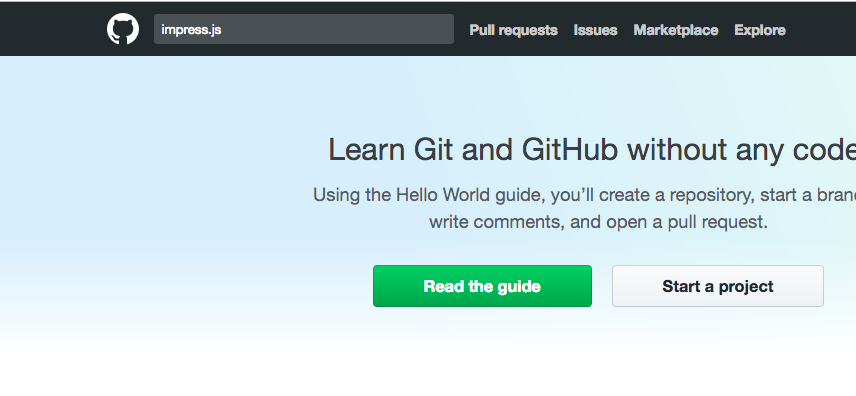

### 2.找到impress.js的资料，并下载

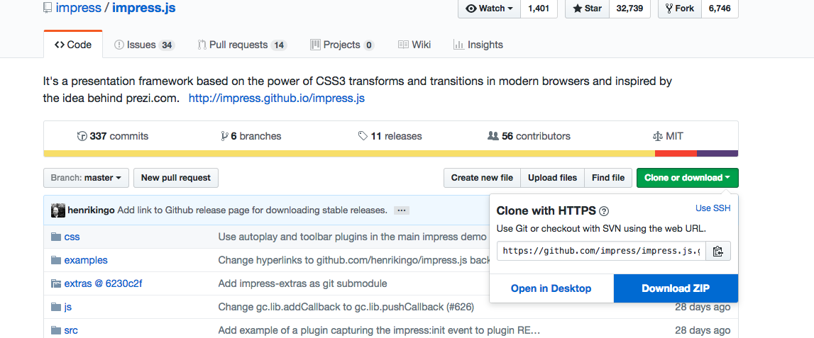

### 3.下载好后，找到index.html文件并打开里面的源代码就可以更改了

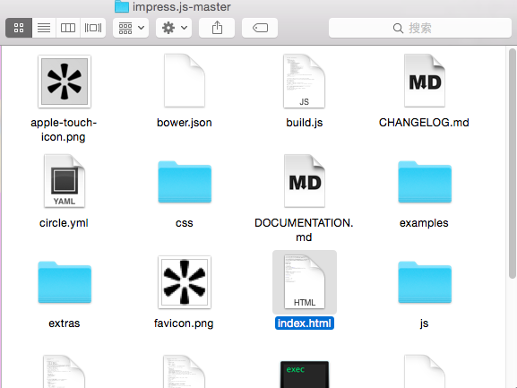

## 二、具体使用过程

### 1.原来的版面是这样的

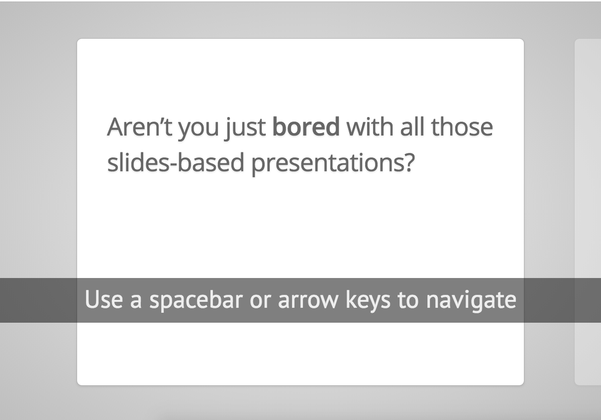

### 2.查看该页面的源代码

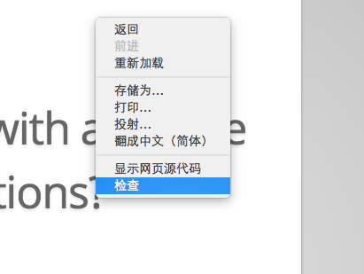

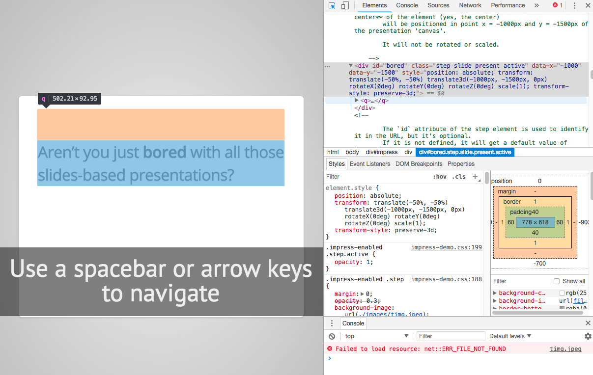

这样可以直观的看到你需要改的地方的代码，左下角有**impress-demo.css:188**是该处的css的行数。

### 3.在index.html里找到你需要改的代码

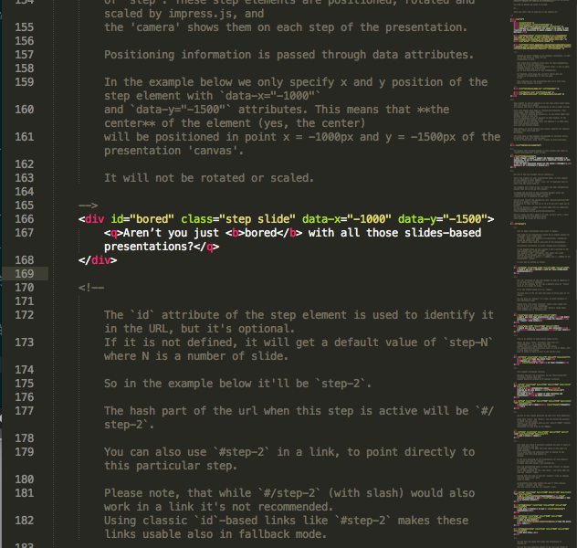


```css
<q>Aren’t you just <b>bored</b> with all those slides-based presentations?</q>
```

把上面这段代码改成自己想要的文字

```css
<q>第十六周工作报告</q>
```

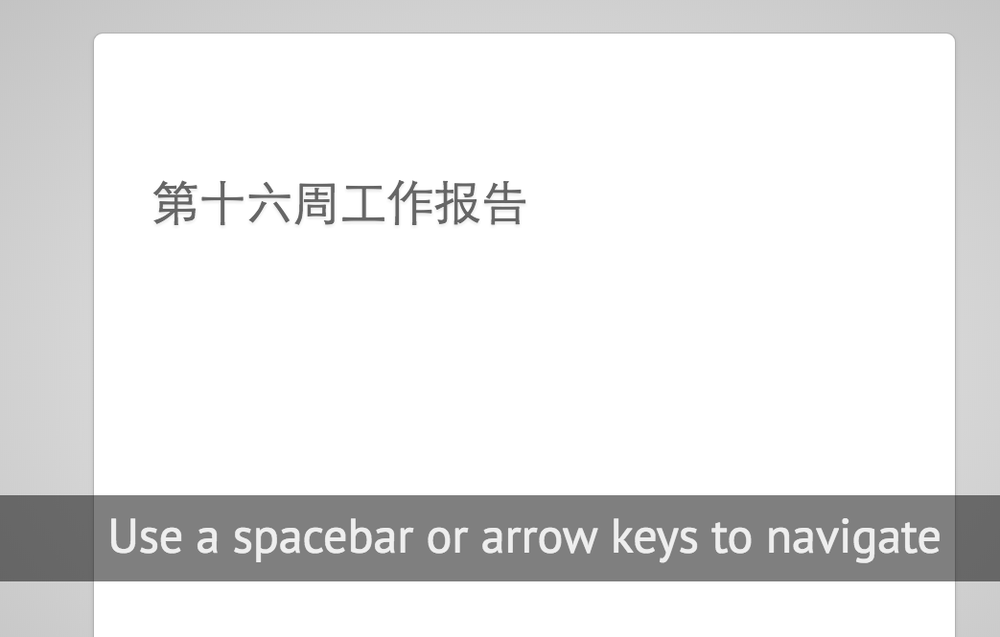

### 4.接下来让文字居中

在div里加一个clss属性(如：ptitle)，并在css里改clss属性

```css
<div id="bored" class="step slide ptitle" data-x="-1000" data-y="-1500">
```

接下来在css里加入ptitle属性

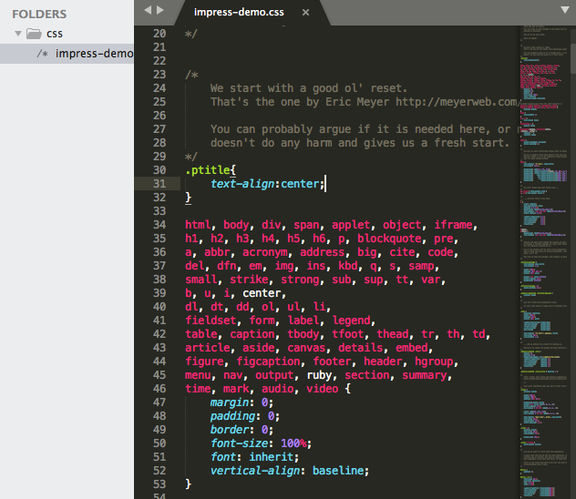

```css
.ptitle{
    text-align:center;
}
```

然后出现以下效果：

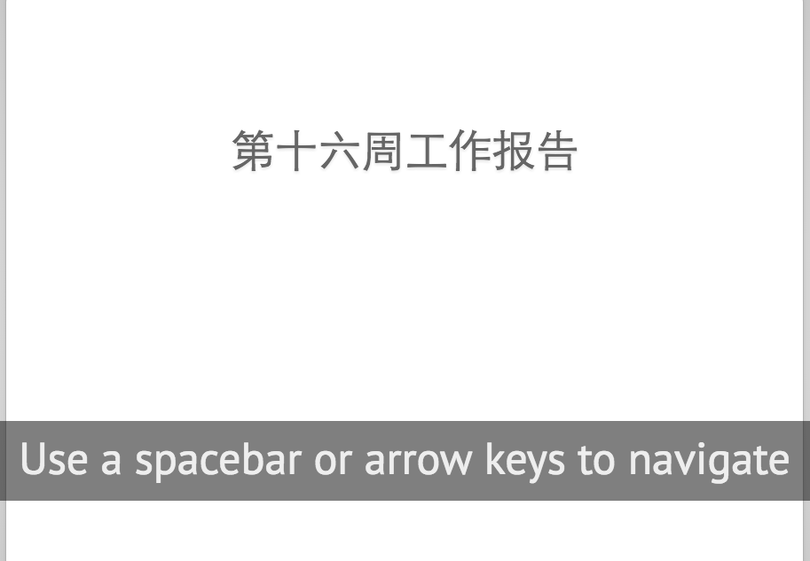

### 5.修改字体形式

1.在浏览器下载自己喜欢的字体，并把这个字体的ttf格式放在css文件夹里

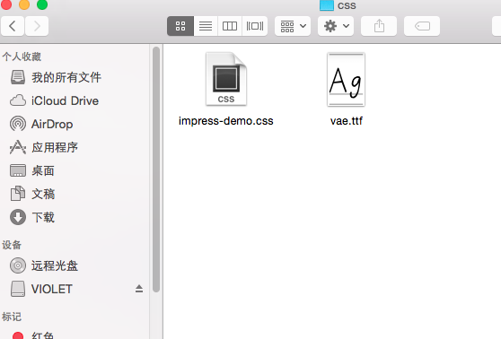


**定义这个字体的属性**：
```css
@font-face{
    font-family: vae;(20.png)
    src:url(vae.ttf);
}
```
 
* 由于这篇html页面文字都加在“p”标签或者“q”标签
* 所以要记住加入class，比如“p”标签或者“q”标签
* 由于很多class里面都有“step”和"slide"标签，所以我们加在这两个标签底下

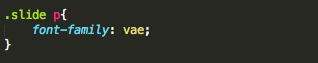

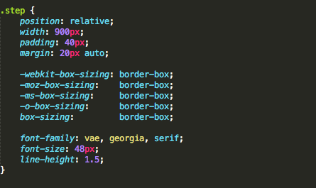

出来的效果如图：


2.在**q**标签里加入自定义的class(如：typeface)

```css
<q class="typeface">第十六周工作报告</q>
```

在**q**标签里加入自定义的class(如：typeface)


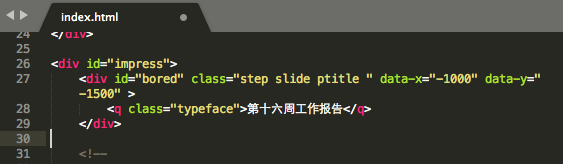

假如你想让字体变粗(bold)，就可以在css里加入**font-weight**属性

```css
.typeface{
    font-family: vae;
    font-weight: bold;
}
```

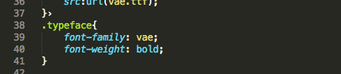

出来的效果如图：


### 6.插入背景图片

在class里加入一个自定义的属性（如：back）

```css
<div id="bored" class="step slide ptitle back" data-x="-1000" data-y="-1500" >
```

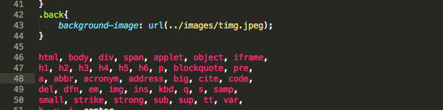

再在css里加入图片的路径

```css
}
.back{
    background-image: url(../images/timg.jpeg);
}
```


最后出来的结果是这样的：

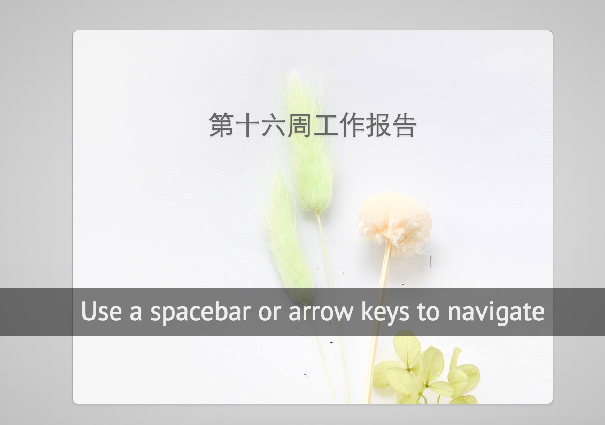

### 7.把下面那条黑色的文字删除

找到html文件最下方，把以下代码注释掉就可以了

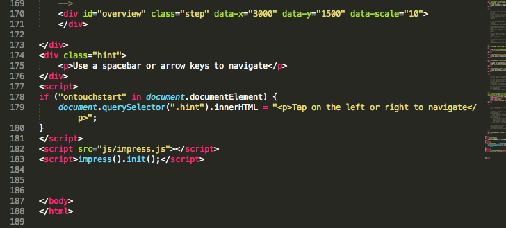

```css
<div class="hint">
    <p>Use a spacebar or arrow keys to navigate</p>
</div>
```
最后出现的结果如图：


### 8.调整文字的位置

如果我想把文字调整到图片的中间

在文字的外面嵌套一个**div**标签（如：location）

```css
<div class="location"><q class="typeface">第十六周工作报告</q></div>
```

在css里加入这个标签的属性

```css
.location{
    position: absolute;
    right: 250px;
    bottom: 350px;
    font-size:50px;
    font-style: italic;
}
```


